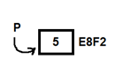
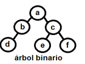
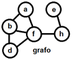

``BLOQUE II``  
``TEMA 3: ESTRUCTURAS DE DATOS``  
``TAD:`` Tipo abstracto de datos.

- Una estructura de datos y los métodos para operar sobre ella.  
- Un ejemplo podría ser un objeto de java, tiene datos, métodos y todo está encapsulado para restringir el acceso.  
- Ejemplo: Una pila y los métodos apilar, desapilar, ordenar,…

``Estructura de Datos:`` Métodos que permiten un almacenamiento eficiente de la información.

- Internas:  
  * Estáticas  
    * Arrays/Matrices.  
    * Registros, uniones.  
  * Dinámicas:  
    * Contenedores de secuenciales.  
      * Listas.  
      * Pilas.  
      * Colas.  
    * Árboles.  
    * Grafos.  
- Externas:  
  * Ficheros.  
  * BBDD.

``Registros:`` Estructuras estáticas de tipos diferentes (campos).  
``Uniones:`` Registros donde además los datos ocupan el mismo espacio en memoria.  
``Arrays:`` Secuencia contigua de elementos (tamaño fijo), si tienes más de una dimensión se llama matriz. Los datos se almacenan consecutivamente en memoria.  
         Ej: ``int x[5]``  --- array de 5 elementos enteros, int x ``[4][3][6]`` --- matriz de tres dimensiones de enteros.  
``Punteros:`` Variables que almacenan una dirección de memoria. (Utilizados a bajo nivel). No necesitan reservar memoria.  * : Para acceder al contenido. &: Para acceder a la dirección de memoria.

``&p`` 🡪 E8F2, ``*p`` 🡪 5

``Listas:`` estructura de datos secuencial dinámica (sin tamaño fijo).

``Pilas (LIFO):`` Last In, First Out --- Último en entrar primero en salir.  
``Colas (FIFO):`` First In, First Out --- Primero en entrar, primero en salir.                                               
	Push (meter dato), Pop (sacar dato), Top (primer elemento)  
``Árboles:`` 

- ``Raíz``: elemento que no tiene antecesor.  
- ``Rama``: arista entre dos nodos.  
- ``Grado``: número de descendientes directos.  
- ``Hoja``: nodo sin descendientes.  
- ``Nivel``: número de nodos que hay que recorrer para llegar a la raíz.  
- ``Árbol equilibrado``: todos los nodos del subárbol izquierdo y del subárbol derecho tienen el mismo nivel o se diferencia como mucho en 1.  
- ``Árbol binario``: un máximo de dos hijos por nodo.  
- ``Árbol AVL``: árbol binario ordenado.  
- ``Árbol B+:`` árbol binario con los nodos hoja enlazados en una lista. Muy útil para búsquedas.  
- Recorridos árbol binario:  
  * ``Preorden``: Nodo – Izquierda – Derecha.			preorden: a,b,d,c,e,f  
  * ``Inorden``: Izquierda – Nodo – Derecha.			inorden: d,b,a,e,c,f  
  * ``Postorden``: Izquierda – Derecha – Nodo.			postorden: d,b,a,e,f,c  
  * ``Amplitud``: recorrer los nodos por niveles.			amplitud: a,b,c,d,e,f

``Grafos:`` árboles no jerárquicos. Las ramas pueden o no tener peso.

``Algoritmo:`` secuencia lógica de pasos a seguir para obtener una solución.

- Orden de complejidad de menor a mayor:  
   O(1) – O(log n) – O(n) – O(n log n) – O (n2) – O (nn) – O(n!) – O(2n)  
- O(1): constante, O(log n): logarítmica, O(n): lineal, O(n2): cuadrática, O(n!): factorial  
- Tipos:  
  * Búsqueda.  
    * Secuencial.  
    * Binaria o dicotómica.  
    * Transformación de claves o Hash.  
  * Ordenación.  
    * Lugar.  
      * Interno.  
        * Selección.  
        * Inserción.  
        * Burbuja.  
      * Externo.  
    * Tiempo.  
      * Natural.  
      * No natural.  
    * Estabilidad.  
      * Estables (al reordenar elementos iguales mantienen su ordenación previa).  
      * No estables.  
- ``Algoritmo de búsqueda:``  
  * ``Secuencial:`` Examinar uno a uno los elementos del array hasta dar con el buscado. Si el array se encuentra ordenado se puede optimizar. O(n)  
  * ``Binaria o dicotómica:`` Sólo se puede aplicar a arrays ordenados. Buscamos el elemento central, si el elemento buscado es mayor miramos a la derecha y si es menor a la izquierda. Repetir la operación con el subarray hasta localizar el elemento. O(log n)  
  * ``Transformación de claves (hashing):`` Asignas a cada elemento un índice, sacado de una función de conversión (función hash). Cuando se quiera buscar algo usamos esos índices para saber dónde buscar.   
- ``Algoritmo de ordenación interna:``  
  * ``Heapsort (montículo):`` Recursivo, no estable. Se utiliza un montículo que contiene el menor/mayor elemento, en una segunda iteración se ordenan los elementos usando dicho montículo. O(n log n)  
  * ``Mergesort (mezcla):`` Recursivo, estable. Separar en 2 partes un vector, ordenar por separado cada una de las partes y luego mezclarlas manteniendo la ordenación.        O(n log n)  
  * ``Selección:`` Se busca el elemento más pequeño y se pone en la primera posición, se repite el proceso con el resto. O(n2)  
  * ``Burbuja (bubblesort):`` Comparar pares de elementos adyacentes e intercambiarlos entre si hasta ordenar todos. O(n2)  
  * ``Shellsort:`` Comparar el elemento con el de un número de posiciones, según va actuando va acortando el salto. O(n log n)  
  * ``Quicksort (rápido):`` Se utiliza un pivote, los elementos menores se pasan a un lado y los mayor al otro. Se repite el proceso en cada uno de los lados n veces. Divide y vencerás. O(n log n).  
  * ``Radix sort:`` Se ordena el array descomponiendo los números en dígitos, de más a menos significativos. Limitado sólo a enteros. O(k n)

Organización de ficheros:

- Sistema de archivos (``file system``): estructura de directorios con algún tipo de organización que permita almacenar, crear y borrar archivos en diferentes formatos.  
- ``Fichero:`` conjunto de registros que pueden ser leídos por el ordenador.  
- ``Bloque (registro físico):`` cantidad de información transferida entre ficheros y memoria principal en una sola operación.  
- ``Factor de blocaje:`` número de registros que entran en un bloque.  
- ``Bloqueo de registros:`` agrupar varios registros en un bloque.  
- ``Fichero multivolumen:`` ficheros muy grandes que no entran en un único soporte.  
- Tipo de acceso:  
  * ``Secuencial:`` recorrer uno a uno hasta encontrar el buscado (cintas).  
    * Los registros se van grabando unos a continuación de otros, sin dejar huecos. Orden lógico = orden físico.  
    * Ventajas:  
      * Aprovecha al máximo el espacio.  
      * Acceso secuencial inmediato.  
      * Puede utilizar cualquier tipo de registro.  
    * Inconvenientes:  
      * Sólo se permite acceso secuencial.  
      * No se puede insertar entre medias de dos registros.  
      * Para borrar es necesario hacer una copia.  
  * ``Secuencial encadenado:`` Exactamente igual que el secuencial pero utilizando listas dinámicas.  
      
  * ``Organización secuencial indexada:`` organización secuencial, apoyada en el uso de índices para acceder directamente al registro.  
    * Parecido a un libro con un índice de capítulos.  
    * Necesita un campo clave que identifique cada registro de forma única.  
    * Organización de índices:  
      * ``ISAM`` (indexed Sequential Access Method)  
      * ``VSAM`` (Virtual Storage Access Method)  
    * Ventajas:  
      * Permite accesos secuenciales y directos.  
      * Se puede actualizar sin necesidad de copia.  
    * Inconvenientes:  
      * Ocupan más espacio.  
      * Tiende aumentar el tiempo de acceso.  
      * No soportan bidireccionales.  
          
  * ``Directo (Random):`` se puede acceder a cualquier sector inmediatamente (discos duros).  
    * La posición en la que se graban los registros está en función de la información que tenga el campo clave del registro.  
    * ``Colisión:`` cuando dos claves dan la misma dirección.  
      * Solución:  
        * Al primer hueco libre. (búsqueda lineal)  
        * A una zona especial del fichero. (overflow)  
    * Clasificación de direccionamiento:  
      * ``Directo``: fichero facturas donde la clave es el número de factura.  
      * ``Asociación``: la clave se almacena en una tabla de memoria.  
      * ``Aleatorio (hashing):`` una función que relacione sin equivocación la clave con el registro.  
    * Ventajas:  
      * Más rápido.  
      * Permite actualización de ficheros.  
      * Permite actualización en tiempo real.  
    * Inconvenientes:  
      * No permite acceso secuencial.  
      * Necesita de tratamiento de colisiones.  
      * Desaprovecha mucho espacio.

| ``Término``  | ``Descripción``                                                                                     |
|--------------|-----------------------------------------------------------------------------------------------------|
| ATA          | Advance Technology Attachment. Interfaz obsoleta de transferencia de datos. También llamada PATA.   |
| 4K           | Resolución de 4096 píxeles.                                                                         |
| AMOLED       | Active Matrix Organic Light Emitting Diodes. Muy utilizada en dispositivos móviles.                 |
| Blue-ray     | Dispositivo de almacenamiento óptico de datos de gran capacidad. Utiliza un rayo azul.             |
| Bluetooth    | Red inalámbrica de área personal.                                                                   |
| Buffer       | Espacio de memoria que almacena datos de manera temporal.                                           |
| BUS          | Sistema digital que transfiere datos entre los componentes de una computadora.                      |
| CCD          | Charge-coupled device. Circuito integrado que registra una imagen. Utilizado en cámaras y escáneres.|
| CD-ROM       | Dispositivo de almacenamiento de tipo óptico.                                                       |
| Cilindro     | Diferentes partes en las que se compone un disco duro magnético.                                    |
| Cluster      | Varios sectores consecutivos. 2^n.                                                                  |
| CRT          | Antiguos televisores de tubos catódicos.                                                            |
| DisplayPort  | Interfaz digital que permite trasmisión de video y audio.                                           |
| DMA          | Acceso Directo a Memoria.                                                                           |
| Driver       | Programa informático que permite al sistema operativo interaccionar con un periférico.             |
| DVD          | Dispositivo de almacenamiento óptico de capacidad elevada.                                          |
| DVI          | Digital Visual Interface. Permite trasmisión de video.                                              |
| Firewire     | IEEE 1934. Conector de entrada salida en serie a gran velocidad.                                    |
| HDD          | Hard Disk Drive. Dispositivo de almacenamiento de datos de tipo magnético.                          |
| HD-DVD       | Evolución de los DVD a un formato de mayor capacidad.                                               |
| HDMI         | High Definition Multimedia Interface. Interfaz de video y audio.                                    |
| Latencia     | Tiempo que transcurre en posicionarse la cabeza lectora en el sector correcto una vez ya en la pista.|
| LED          | Light Emitting Diode. Diodo que emite luz. Rojo, Azul y Verde. Utilizado en ciertos televisores.    |
| Light Peak   | Antigua forma de llamar al conector Thunderbolt.                                                    |
| LTO          | Linear Tape Open. Tipo de cinta magnética de almacenamiento de datos.                               |
| MHL          | High Definition Link. Tecnología que permite conectar dispositivos móviles a televisores de alta definición. |
| OCR          | Optical Character Recognition. Proceso que permite reconocer caracteres en una digitalización.      |
| OLED         | Organic LED. Tecnología con componentes orgánicos que reaccionan ante estimulación eléctrica.       |
| OTG          | On The Go. Extensión de USB que permite a los dispositivos USB actuar como host.                    |
| PCI          | Interconexión de componentes periféricos. Bus estándar para conectar periféricos.                    |
| PCI-Express  | Evolución de PCI consiguiendo mayores velocidades. Trabaja en Full Dúplex.                          |
| PDL          | Lenguaje de descripción de página. Codifica un documento en un lenguaje que la impresora interpreta. |
| PDP          | Pantalla de Plasma. Pantalla plana usada en televisores de gran formato. Llena de gases de nitrógeno.|
| Pista        | Diferentes partes en las que se compone un cilindro en discos duros magnéticos.                     |
| PnP          | Plug and play. Tecnología que permite a un dispositivo informático ser conectado a una computadora.  |
| PPP          | Puntos por pulgada. Unidad de medida para resoluciones de impresión.                                |
| PS/2         | Conector serie utilizado generalmente para conectar teclados y ratones al ordenador.                |
| SATA         | Serial Advance Technology Attachment. Interfaz sustituta de ATA.                                    |
| Sector       | Diferentes partes en las que se compone una pista en discos duros magnéticos.                       |
| Slot         | Conector o puerto de expansión en la placa base de un ordenador.                                     |
| SSD          | Solid State Drive. Dispositivo de almacenamiento de datos que utiliza memoria no volátil como la flash.|
| TFT-LCD      | Thin Film Transistor-Liquid Crystal Display. Pantallas de cristal líquido con tecnología de transistores. |
| Thunderbolt  | Conector de alta velocidad.                                                                         |
| USB          | Universal Serial Bus.                                                                               |
| VGA          | Video Graphics Array. Conector estándar de transmisión de video.                                    |
| WIFI         | IEEE 802.11. Conexión de dispositivos electrónicos de forma inalámbrica.                            |
| WUSB         | Wireless USB.                                                                                       |
| Ploter       | Tipo de impresora de gráficos, muy utilizada en publicidad.                                         |
