``BLOQUE II``  
``TEMA 1: INFORMÁTICA BÁSICA``  
``Generaciones:``

- 1ª Generación (1946 – 1954): Válvulas de vacío.  
- 2ª Generación (1955 – 1964): Transistores.  
- 3ª Generación (1965 – 1970): Tecnología SSI (Short Scale Integration).

         Tecnología MSI (Medium Scale Integration).

- 4ª Generación (1971 – 1981): Tecnología LSI (Large Scale Integration), primeros pc´s.  
- 5ª Generación (1982 – actualidad): pc´s actuales, mejores y más rápidos.

| kilobyte (kB) | 103 | [kibibyte](https://es.wikipedia.org/wiki/Kibibyte) (KiB) | 210 |
| :---- | :---: | :---- | :---: |
| [megabyte](https://es.wikipedia.org/wiki/Megabyte) (MB) | 106 | [mebibyte](https://es.wikipedia.org/wiki/Mebibyte) (MiB) | 220 |
| [gigabyte](https://es.wikipedia.org/wiki/Gigabyte) (GB) | 109 | [gibibyte](https://es.wikipedia.org/wiki/Gibibyte) (GiB) | 230 |
| [terabyte](https://es.wikipedia.org/wiki/Terabyte) (TB) | 1012 | [tebibyte](https://es.wikipedia.org/wiki/Tebibyte) (TiB) | 240 |
| [petabyte](https://es.wikipedia.org/wiki/Petabyte) (PB) | 1015 | [pebibyte](https://es.wikipedia.org/wiki/Pebibyte) (PiB) | 250 |
| [exabyte](https://es.wikipedia.org/wiki/Exabyte) (EB) | 1018 | [exbibyte](https://es.wikipedia.org/wiki/Exbibyte) (EiB) | 260 |
| [zettabyte](https://es.wikipedia.org/wiki/Zettabyte) (ZB) | 1021 | [zebibyte](https://es.wikipedia.org/wiki/Zebibyte) (ZiB) | 270 |
| [yottabyte](https://es.wikipedia.org/wiki/Yottabyte) (YB) | 1024 | [yobibyte](https://es.wikipedia.org/wiki/Yobibyte) (YiB) | 280 |
| brontobyte (BB) | 1027 | brontibyte (BiB) | 290 |
| geopbyte (geB) | 1030 | geopbibyte (GeiB) | 2100 |

``Sistemas de numeración:``

- Bit (binary digit): 0, 1\.  
- Nibble (cuarteto): 4 bits.  
- Byte (octeto): 8bits \= 23 bits.  
- Binario: sólo utilizar 0, 1\. Base(2)  
- Octal: 0, 1, 2, 3, 4, 5, 6, 7\. Base (8)  
- Hexadecimal: 0-9,A, B, C, D, E, F. Base (16)  
- Ca2: Complemento a 2\. Número enteros negativos.     
        Nº 	 	       0110   
        Invertir el número 1001  
        Sumarle 1	          \+ 1

		Ca2 del nº original      ``1010``

- Ca1: Complemento a 1\. Igual pero sin sumar 1\.  
- Coma flotante: número decimales.

``Sistemas de Información:``

- Por objetivo principal:  
  * ``Horizontal:`` No es el objetivo principal de la empresa. Dentro de cada   
    nivel las funciones se subdividen en aplicaciones o procedimientos.  
  * ``Verticales:`` Si es el objetivo principal. Se dividen en tres niveles.  
    * ``Nivel operacional``: Más bajo, sistemas transaccionales, proceso de datos. Procedimientos de rutina. BBDD.  
    * ``Nivel administrativo:`` decisiones a corto plazo. DSS, EIS, GDSS, EDSS.  
    * ``Nivel estratégico:`` decisiones a largo plazo. Conseguir ventajas frente a la competencia.  
- Por arquitectura:  
  * ``Centralizadas.``  
  * ``Descentralizadas o distribuidas.``  
- Por complejidad:  
  * ``TPS`` (Procesadores de transacciones)  
    * Registran y almacenan la información. Cajas registradoras.  
  * ``MIS`` (Sistemas de información para la gestión)  
    * Decisiones no rutinarias, pero sí muy predecibles que se repiten con el tiempo.  
  * ``DSS`` (Toma de decisiones directivas)  
    * Diseñan una solución, no la crean. BBDD, Excel, R3, SAP.  
  * ``EIS`` (Sistemas de información para ejecutivos)  
    * Informes resumidos para la alta administración.  
    * Información crítica para el negocio.  
  * ``GDSS`` (Sistemas de soporte para decisión de grupos)  
    * Fáciles de aprender y usar.  
    * Evitan las conductas negativas.  
    * Motiva a los miembros del grupo a colaborar.  
  * ``EDSS`` (Sistemas expertos)  
    * Basados en inteligencia artificial, uso de heurísticos y aprendizaje evolutivo.  
    * Componentes:  
      * Base de conocimiento.  
      * Máquina de inferencia.  
      * Memoria de trabajo.  
- Partes de un Sistema de información:  
  * ``Objetivo``: Detener un coche.  
  * ``Elemento``: Partes del coche, líquido de frenos, ruedas.  
  * ``Subsistema``: Motor eléctrico, sistema de frenado, seguridad.  
  * ``Ambiente``: Clima, carretera.  
  * ``Sinergia``: Las partes por separado no consiguen nada, hay que funcionar como un todo. El líquido de freno no hace nada por sí solo.  
  * ``Equifinidad``: Otras formas de conseguir el mismo objetivo. Freno motor, freno de mano.

Arquitectura Von Newman:

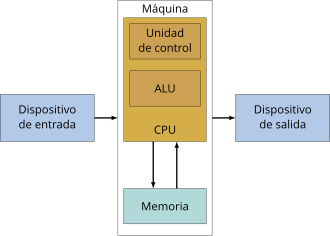

- ``MP`` (Memoria principal): Guarda información que se está usando.  
- ``MS`` (Memoria secundaria): Guarda información para utilizar en otro momento.  
- ``E/S`` (entrada/salida): Por donde se introducen o se saca la información.  
- ``CPU``: Unidad central de proceso, compuesta por la UC y la ALU.  
- ``UC`` (Unidad de control):  
  * ``CP`` (Contador de programa): Contiene la siguiente instrucción a ejecutar.  
  * ``RI`` (Registro de instrucción): la instrucción que se está ejecutando.  
  * ``Decodificador``: Extrae el código de la instrucción en uso y emite las señales oportunas.  
  * ``Reloj:`` Proporciona los impulsos necesarios.  
- ``ALU`` (Unidad Aritmético-Lógica):  
  * Circuito operacional: Implementación electrónica de las operaciones necesarias.  
  * Registro de entrada: almacena los datos de la instrucción.  
  * Registro acumulador: almacena el resultado.  
  * Registro de estado: guardan condiciones. Llamados ``Flags``.  
    

| Tipos de Flags |  |  |  |
| :---- | :---: | :---- | :---: |
| ``CF`` (Flag Carry) | 1 \= arrastre | ``PF`` (Flag Paridad) | 1 \= par |
| ``AF`` (Carry Aux) | 1 \= decimal | ``ZF`` (Flag Zero) | 1 \= 0 |
| ``SF`` (Flag Signo) | 1 \= negativo | ``TF`` (Flag Trap) | 1 \= paso a paso |
| ``IF`` (Flag Interrupción) | 1 \= interrupción | ``DF`` (Flag dirección) | 1 \= autoincremento 0 \= postincremento |
| ``OF`` (Flag Overflow) | 1 \= desbordamiento |  |  |

- Definiciones:  
  * ``Estructura``: componentes. Ejemplo ALU.  
  * ``Arquitectura``: organización y el funcionamiento.  
  * ``MIPS``: millones de instrucciones de la máquina por segundo.  
  * ``MFLOPS``: millones de operaciones en coma flotante por segundo.  
  * ``Frecuencia (Hz):`` número de veces que se repite el reloj por segundo.  
  * ``Buses``: medio por el cual se acede a los datos.  
  * ``Microinstrucciones``: conjunto de instrucciones que construye un programa.  
  * ``Pipeling o segmentación``: mientras se decodifica una instrucción se ejecuta parte de la siguiente, consiguiendo solapar instrucciones.  
  * ``CISC`` (Complex instruction Set Computer):  
    * Conjunto complejo de instrucciones. Más antiguo.  
    * Sólo funcionan bien con instrucciones concretas.  
    * Microprogramación  
    * Varios ciclos por instrucción.  
  * ``RISC`` (Reduced Instruction Set Computer):  
    * Conjunto reducido de instrucciones. Más utilizado.  
    * Consiste en descomponer una instrucción compleja en muchas simples.  
    * Más rápida que las CISC.  
    * Cableada.  
    * Un ciclo por instrucción.  
  * ``Multiplexor``: Circuito electrónico de n entradas y 2n salidas. En función de la entrada se elige un camino.  
  * ``Codificador``: Transforma binario en una señal.  
  * ``Decodificador``: Al revés, transforma una señal a binario.

``Memorias:``

- Volátil: el contenido de la memoria permanece mientras tenga alimentación. (RAM).  
- No volátil: el contenido de la memoria no se pierde aunque se deje al dispositivo sin alimentación. (Flash, ROM).  
- Terminología:  
  * ``FSB`` (Front Side Bus): Bus comunica procesador con memoria. Nos da la velocidad del bus de memoria.  
  * ``CAS`` (Column Adress Strobe): Número de ciclos necesarios para acceder a la columna de un dato en concreto.  
  * ``RAS`` (Row Adress Strobe): Lo mismo pero para la fila.  
  * ``Timing``: La latencia, determina la calidad de la memoria.  
  * ``Dual Channel``: igualar tamaño y velocidad.  
  * ``O/C`` (overclocking): incrementa la velocidad del sistema, acelerando los pulsos del reloj, peligroso ya que puede dañar la placa a largo plazo.  
  * ``Tiempo de acceso``: Tiempo que se tarda en localizar un dato en memoria.  
  * ``VCore``: Voltaje del funcionamiento del procesador.

  

- ``ROM (Read Only Memory)``  
  * ``ROM``: memoria grabadas por el fabricante con unos datos fijos.  
  * ``PROM`` (Programmable ROM): se puede grabar el contenido una única vez.  
  * ``EPROM`` (Erasable PROM): Se puede borrar y reescribir contenido por rayos ultravioleta.  
  * ``EEPROM`` (Electrically Eresable PROM): pueden grabarse contenido por medios eléctricos. (Flash).  
  * ``EAROM`` (Electrically Alterable ROM): Software sólo lectura, eléctricamente se pueden modificar.  
- ``RAM (Random Access Memory):``  
  * ``DRAM`` (Dinamic RAM): Necesitan refresco de reloj. Se utilizan principalmente como memorias principales. Almacenan los datos en condensadores. DRAM, FPM, EDO, BEDO.  
  * ``SDRAM`` (Sincronous Dinamic RAM): Memoria por doble tasa de transferencia. DDR (doublé data rate). DDR – 2 canales, DDR2 – 4 canales, DDR3 – 8 canales, DDR4 – módulo único.  
  * ``SRAM`` (Static Ram): Almacenan los bits en biestables, no necesitan refresco. Son más rápidas que las DRAM. Volátiles. Muy utilizadas en memorias Caché.  
  * ``Caché``: Memoria intermedia entre MP y registros. Almacenan posiciones que se van a utilizar frecuentemente.  
    * ``Escritura directa``: La información se escribe en caché y en la MP.  
    * ``Postescritura``: La información se escribe sólo en caché, sólo cuando salga de caché se escribe en MP.  
    * Dos tipos: ``L1`` – Interna, dentro de la CPU. Más rápida. ``L2`` – Fuera de la CPU, más lenta y secundaria.  
  * ``Flash``: No volátil, acceso múltiple. Utilizada en BIOS. Alta integración y fácil fabricación. Permite varias lecturas y escrituras simultaneas.  
- ``Tamaño memoria:``  
  * ``Palabra``: Tamaño de cada línea.  
  * El bus de datos determina el número de  
    palabras que esa memoria puede almacenar.  
    10 hilos sería 210 palabras.

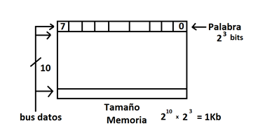

Tipos de direccionamiento:

- ``Implícito``: no hay que poner ninguna dirección dentro de la instrucción. El dato va implícito en el tipo de instrucción. Ej: Incremento \--- Ya se sabe que el valor es un \+1.  
- ``Inmediato``: Dentro de la instrucción se incluye el dato.  
- ``Directo``: Dentro de la instrucción se incluye la dirección donde se encuentra el operando.  
- ``Indirecto``: Dentro de la instrucción se incluye una dirección, en la que se encuentra otra dirección donde está el dato.  
- ``Relativo``: La dirección del dato se calcula con una dirección base más un desplazamiento.

 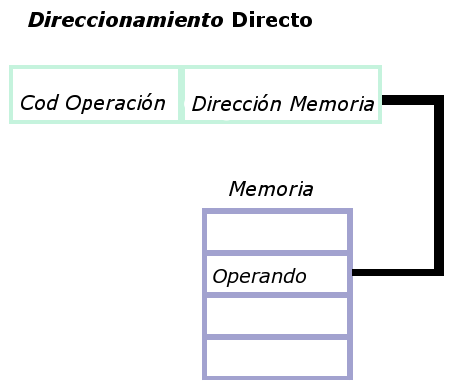 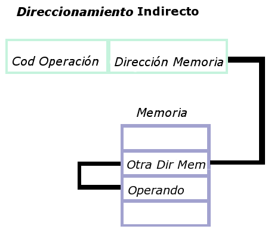 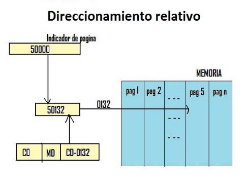

``RAID (Redundant Array of Inexpensive Disks)``

- Usa discos duros o ssd.  
- La configuración se llama nivel.  
- Existen Raid software (más flexibles) y hardware.  
- Niveles:  
  * ``Nivel 0``: Conjunto dividido, o no raid.  
    * Distribución equitativa entre dos discos.  
    * No hay redundancia de datos. 

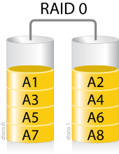

  * ``Nivel 1``: Espejo.  
    * Un disco contiene la copia exacta del otro.  

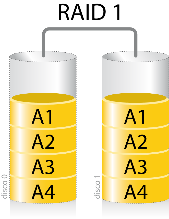

  * ``Nivel 2``: División a nivel de bits.  
    * Con disco de paridad dedicado.  
    * Genera cuellos de botella, rara vez utilizado.  
    
  * ``Nivel 3``: División por bytes. No se usa. 

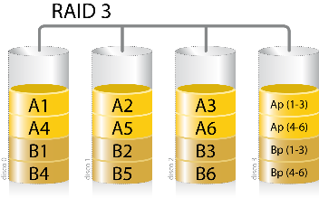

  * ``Nivel 4``: IDA (acceso independiente con discos de paridad dedicada)  
    * Divide por bloques, no por bytes.  

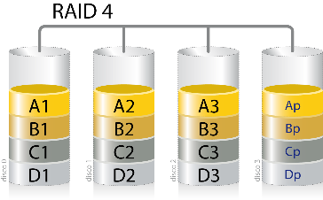

  * ``Nivel 5``: Distribución con paridad.  
    * No tiene un disco dedicado, la paridad se incluye entre los datos.  
    * Muy popular, se necesitan un mínimo de 3 discos. 

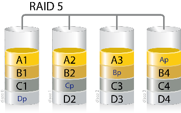

  * ``Nivel 6``: Igual que el 5 pero con dos bloques de paridad.  
    * Evita muchos errores  

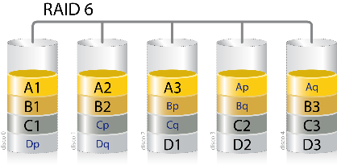

  * ``Nivel 5E, 6E``: Variedad del nivel 5 y 6 con disco de reserva.  
  * Existen niveles combinados, ``0+1``, ``30``, ``100``, ``10+1``.